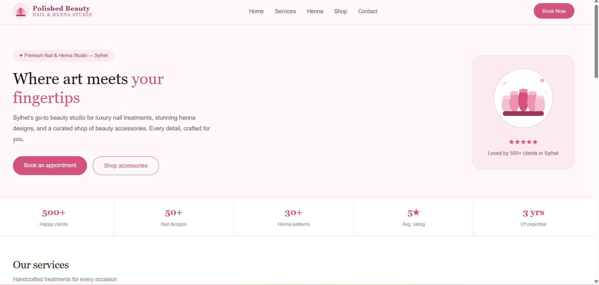
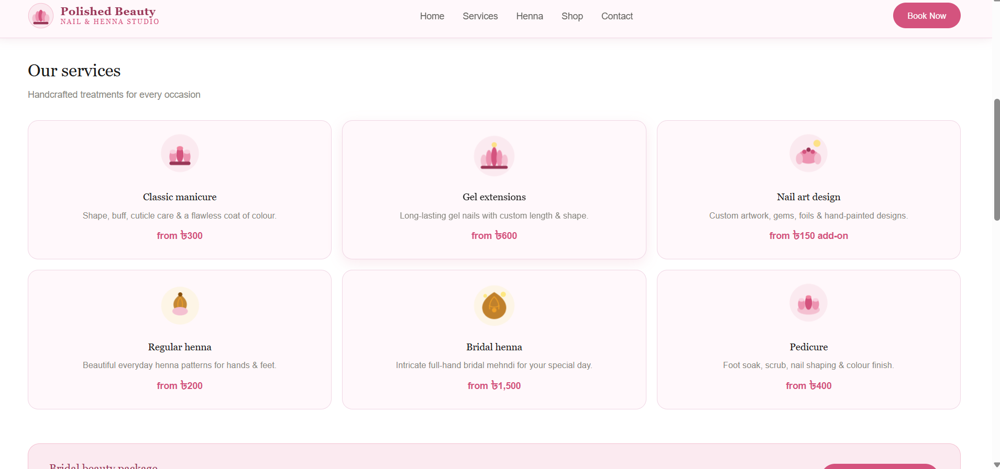
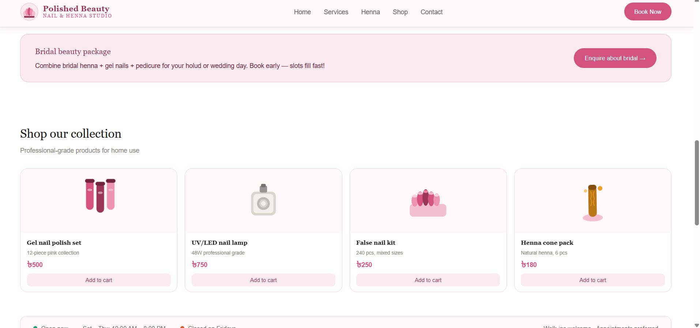
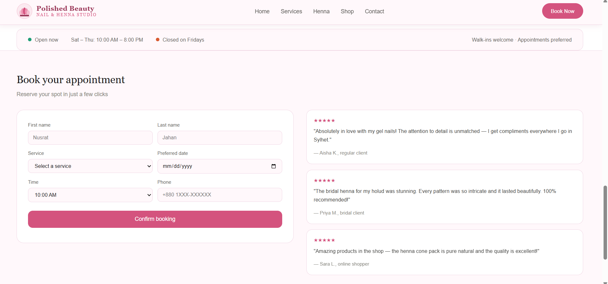
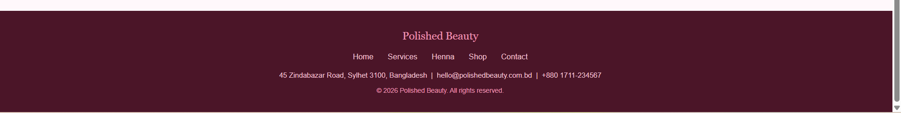

# POLISHED_BEAUTY
 Polished Beauty – Nail & Henna Studio
A  beauty salon website , built using HTML, CSS, JavaScript, and PHP.  
It allows users to explore services and book appointments.

## ✨ Features
- 🧾 Appointment booking form (with PHP backend)
- 💅 Service showcase (manicure, henna, pedicure, etc.)
- ⭐ Customer testimonials
- 📊 Business stats (clients, ratings, experience)
- 📱 Responsive & clean UI design
- 🎨 Smooth button interactions and hover effects
- 
## 🚀 How to Run
1. Copy folder to xampp/htdocs
2. Start Apache in XAMPP
3. Open http://localhost/POLISHED_BEAUTY/

## ⚠️ Note
bookings.txt is ignored using .gitignore for privacy.  

## 📁 Project Structure
polished_beauty/
│── index.html
│── style.css
│── script.js
│── submit_booking.php
│── images/
   ├── homepage.png
   ├── services.png
   ├── products.png
   ├── booking.png
   └── footer.png

### 🏠 Homepage

### 💅 Services

 ### 🛍️ Products

### 📅 Booking

### 🔻 Footer

